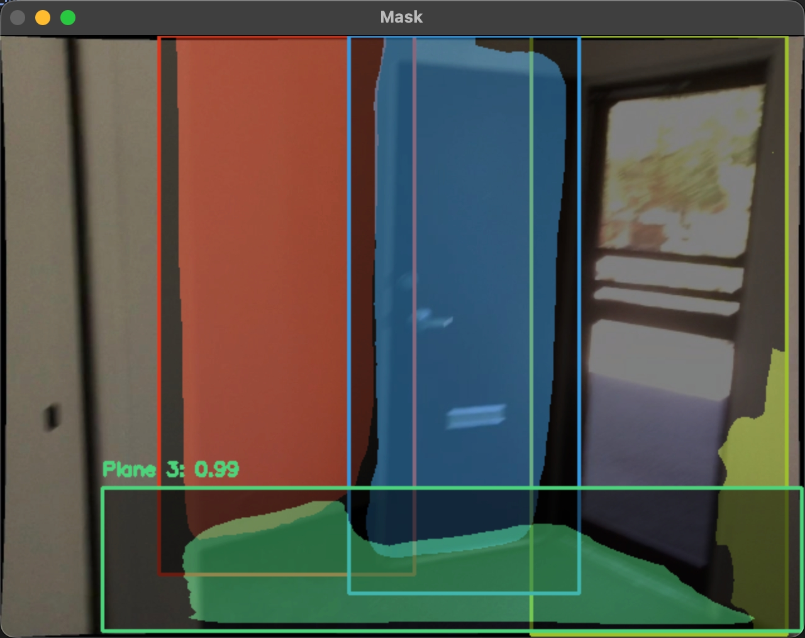

# InferPlaneRCNN
The original implementation of PlaneRCNN is [here](https://github.com/NVlabs/planercnn), but it's not well-maintained and too old(requires python3.7 and pytorch=0.4.1). Also, the code quality is terrible. Code like this is everywhere:
``` python
images, image_metas, rpn_match, rpn_bbox, gt_class_ids, gt_boxes, gt_masks, gt_parameters, gt_depth, extrinsics, planes, gt_segmentation = sample[indexOffset + 0].to(self.device), sample[indexOffset + 1].numpy(), sample[indexOffset + 2].to(self.device), sample[indexOffset + 3].to(self.device), sample[indexOffset + 4].to(self.device), sample[indexOffset + 5].to(self.device), sample[indexOffset + 6].to(self.device), sample[indexOffset + 7].to(self.device), sample[indexOffset + 8].to(self.device), sample[indexOffset + 9].to(self.device), sample[indexOffset + 10].to(self.device), sample[indexOffset + 11].to(self.device)
rpn_class_logits, rpn_pred_bbox, target_class_ids, mrcnn_class_logits, target_deltas, mrcnn_bbox, target_mask, mrcnn_mask, target_parameters, mrcnn_parameters, detections, detection_masks, detection_gt_parameters, detection_gt_masks, rpn_rois, roi_features, roi_indices, depth_np_pred = self.model.predict([images, image_metas, gt_class_ids, gt_boxes, gt_masks, gt_parameters, camera], mode='inference_detection', use_nms=2, use_refinement=True)
```
Neither reading the code nor reading the paper can help you understand the logic of this model. So I rewrite it. (Only the inference part.)

Test it out by placing your weight to `./checkpoints/checkpoint.pth` and run `uv run inference.py`. A window will pop up, showing the masks.


You can download the weight from the [original link(Dropbox)](https://www.dropbox.com/s/yjcg6s57n581sk0/checkpoint.zip?dl=0) or [Hugging Face](https://huggingface.co/ovo-tim/PlaneRCNN).